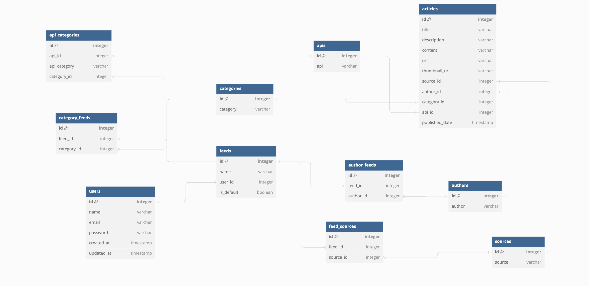

# news-aggregator-backend
- Make a new file called .env that is copied from .env.example. Most of the defaults are set including the database.
- Set the value of the API Keys for the following variables `NEWS_API_KEY`, `GUARDIAN_API_KEY` and `NEW_YORK_TIMES_API_KEY`
- Run the following command to run the instance
    > `docker-compose up`
- Run the following command to run the migrations
    `docker-compose exec app composer install`
- Run the following command to run the migrations
    > `docker-compose exec app php artisan migrate`
- Run the following command to seed the database with the initial set of values. This will take roughly *10 minutes*
    > `docker-compose exec app php artisan db:seed`

Your application should now be readily accessible from the front with the data ready.

# Database Diagram

